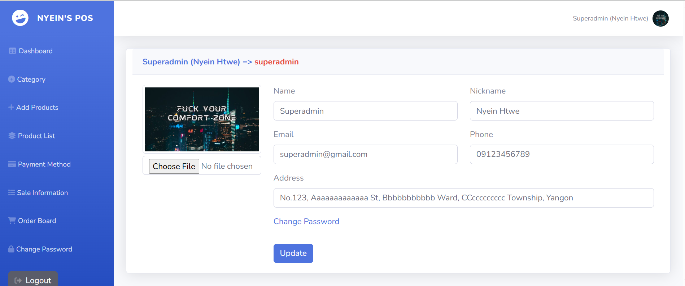
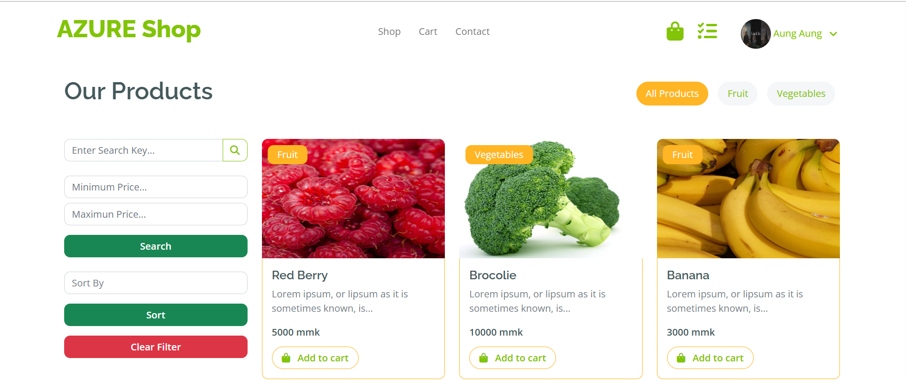
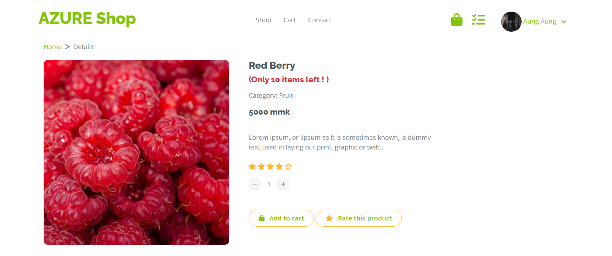

# 🍕 PizzaOrderSystem

A full-featured, Shopping web application built with PHP, Blade, SCSS, CSS, and JavaScript, Bootstrap, Jquery. Easily customize your products, manage orders, and deliver a seamless experience for both customers and staff.

---

## 🚀 Features

-   User-friendly shopping interface
-   Dynamic shopping cards with customizable products and details
-   Secure user authentication and registration
-   Order history and status tracking
-   Responsive design for mobile and desktop
-   Admin dashboard for managing items and orders
-   Real-time order

---

## Screenshots

### Admin Side

| Product List                                                         | Profile                                                     |
| -------------------------------------------------------------------- | ----------------------------------------------------------- |
|  |  |

### User Side

| Homepage                                                   | Product Details                                                    |
| ---------------------------------------------------------- | ------------------------------------------------------------------ |
|  |  |

## 🛠 Tech Stack

  
  
  
  
  
  
  
  

| Technology              | Usage         |
| ----------------------- | ------------- |
| PHP/Laravel             | Backend logic |
| Blade                   | Templating    |
| SCSS/CSS/Bootstrap      | Styling       |
| JavaScript/Jquery(AJAX) | Interactivity |

---

## ⚡ Getting Started

### Prerequisites

-   PHP 8.x+
-   Composer
-   Node.js & npm
-   (Optional) MySQL or SQLite for database
