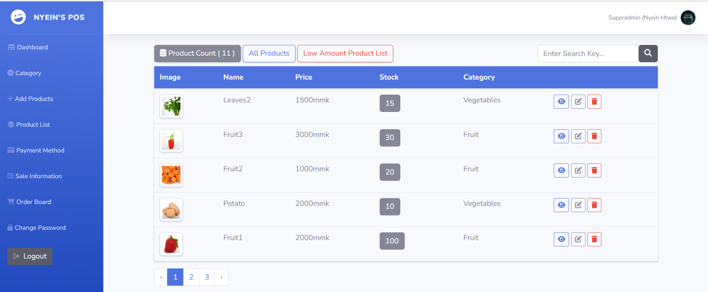
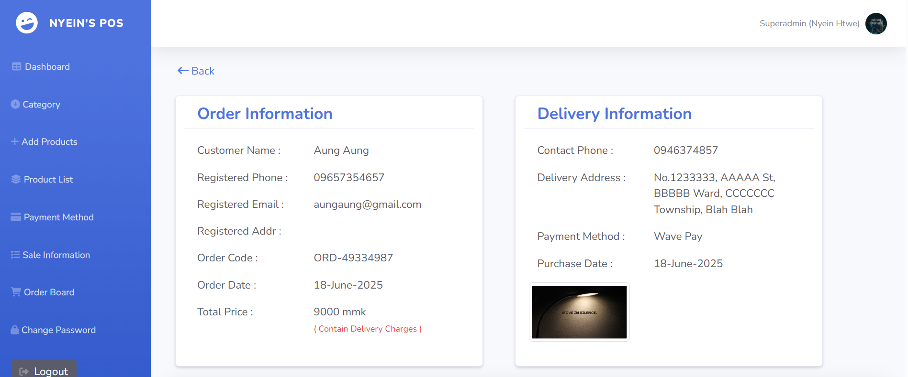

# 🍕 PizzaOrderSystem

A full-featured, Shopping web application built with PHP, Blade, SCSS, CSS, and JavaScript, Bootstrap, Jquery. Easily customize your products, manage orders, and deliver a seamless experience for both customers and staff.

---

## 🚀 Features

-   User-friendly shopping interface
-   Dynamic shopping cards with customizable products and details
-   Secure user authentication and registration
-   Order history and status tracking
-   Responsive design for mobile and desktop
-   Admin dashboard for managing items and orders
-   Real-time order

---

## Screenshots

## Screenshots

### Admin Side





### User Side


## 🛠 Tech Stack

<p align="left">
  
  
  
  
  
  
  
  
</p>

| Technology              | Usage         |
| ----------------------- | ------------- |
| PHP/Laravel             | Backend logic |
| Blade                   | Templating    |
| SCSS/CSS/Bootstrap      | Styling       |
| JavaScript/Jquery(AJAX) | Interactivity |

---

## ⚡ Getting Started

### Prerequisites

-   PHP 8.x+
-   Composer
-   Node.js & npm
-   (Optional) MySQL or SQLite for database

### Installation

```bash
# 1. Clone the repository
git clone https://github.com/AdollaBurst22/PizzaOrderSystem.git
cd PizzaOrderSystem

# 2. Install PHP dependencies
composer install

# 3. Install JS/CSS dependencies & compile assets
npm install
npm run dev

# 4. Configure Environment
# Copy .env.example to .env and update your database and mail credentials

# 5. Run database migrations
php artisan migrate

# 6. Serve the application
php artisan serve

PizzaOrderSystem/
├── app/                # Backend logic (controllers, models)
├── resources/
│   ├── views/          # Blade templates
│   └── scss/           # SCSS source files
├── public/             # Public assets (CSS, JS, images)
├── routes/             # Web routes
├── database/           # Migrations, seeders
├── package.json
├── composer.json
└── ...
```
